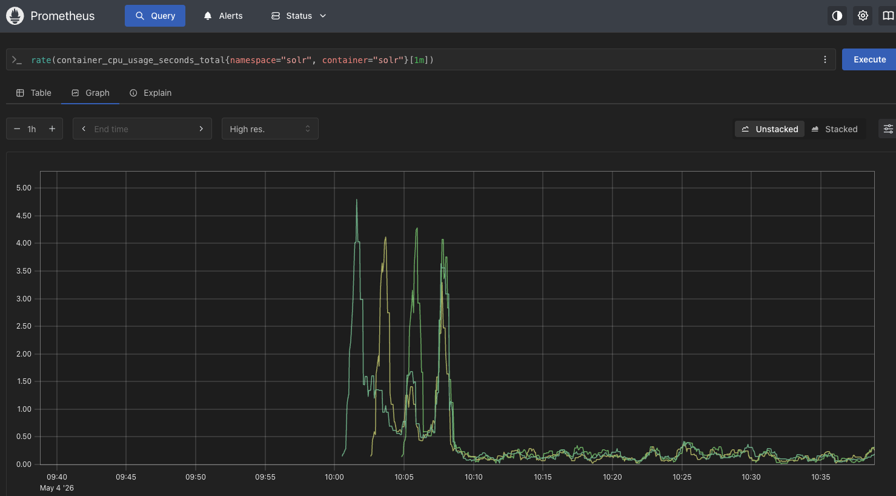
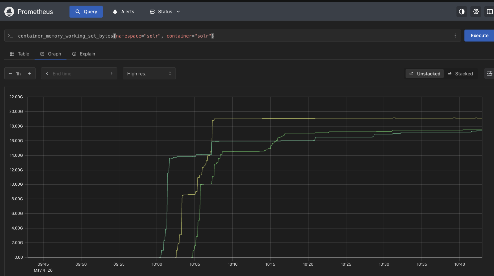

All times in UTC

* 10:05 am rolled the service with new pods, to avoid caching issues
* 10:06 am started the load test with 200 threads, 100 loops, ramp time 1, against production large collection (25.6Gb, 31.6mn docs) with two replicas, 1 shard (`56e0eb81-c2d5-4d5d-9171-b251bf7299a4`)
* 10:07 am load test completed

Prometheus graph of CPU over time

Prometheus graph of Memory over time

### Key takeaways

The steps were:
1. Roll the pods so that we have a comparable cache for each test
2. Delete any old job that was hanging out so we could run it again
3. Apply the kubernetes resources, including the job, resulting in running the load test (done during low-traffic times)
4. Download the raw data and reports.

After increasing the number of pods and the number of replicas to 3 each, and copying the replicas to the new pod, we saw a considerable improvement in performance.

Our Apdex went up from 0.88 to 0.95 (so our number of satisfied hypothetical users went up), and our average response time went down from 374ms to 242ms.

The memory usage stayed basically the same across runs (unsurprising since Solr likes to keep everything in memory and we didn't change those configs), but the CPU spike went down from about 5.25 CPU to 4.25 CPU.

One metric that did not improve was the 99th percentile response. The max, median, 90th, and 95th percentiles all improved. The 99th percentile response time went up from 2886ms to 3162ms. One hypothesis is that our collection may have grown between the baseline and the test. The throughput and network sent / received also increased between the baseline and this test, which is part of why I think it might be related to overall collection size.
