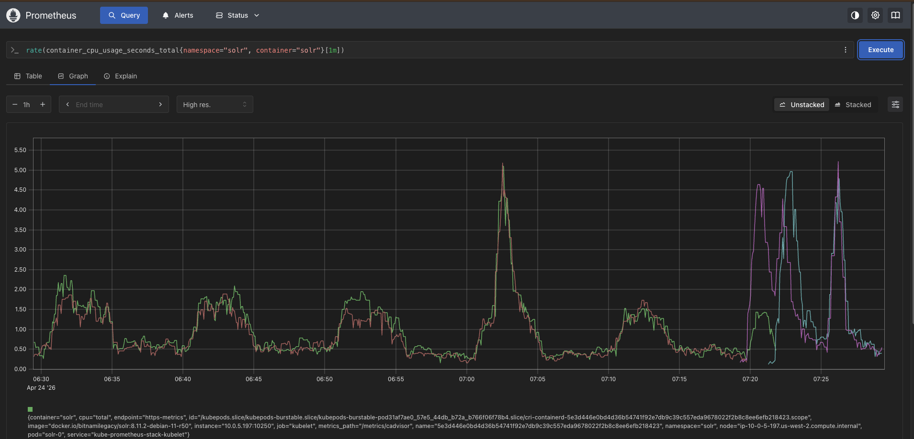
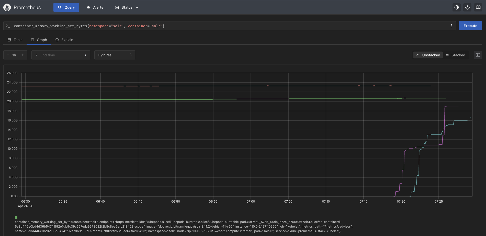

All times in UTC

* 7:20 am rolled the service with new pods, to avoid caching issues
* 7:25 am started the load test with 200 threads, 100 loops, ramp time 1, against production large collection (25.6Gb, 31.6mn docs) with two replicas, 1 shard (`56e0eb81-c2d5-4d5d-9171-b251bf7299a4`)
* 7:26 am load test completed

Prometheus graph of CPU over time

Prometheus graph of Memory over time

